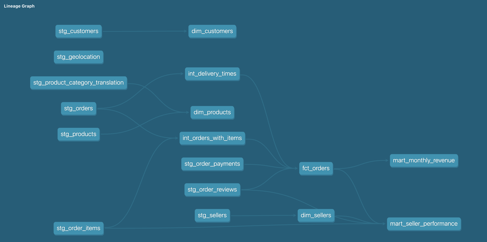

# Olist Analytics Pipeline

Pipeline de analytics engineering end-to-end construído sobre o dataset público da Olist, empresa brasileira de e-commerce.

## Arquitetura
```
CSVs (Olist) → Python (ingestão) → DuckDB (raw) → dbt (staging → intermediate → marts) → Airflow (orquestração)
```



## Stack

| Camada | Tecnologia |
|---|---|
| Ingestão | Python + Pandas |
| Storage | DuckDB |
| Transformação | dbt-core 1.7 |
| Testes | dbt tests + dbt-expectations |
| Orquestração | Apache Airflow 2.9 (Docker) |

## Estrutura do projeto
```
olist-analytics-pipeline/
├── ingestion/                  # Script de ingestão dos CSVs para DuckDB
│   └── load_to_duckdb.py
├── olist_analytics/            # Projeto dbt
│   ├── models/
│   │   ├── staging/            # Limpeza e tipagem das 9 fontes
│   │   ├── intermediate/       # Lógica de negócio intermediária
│   │   └── marts/              # Tabelas analíticas finais
│   ├── macros/                 # Macros reutilizáveis
│   ├── tests/                  # Testes customizados
│   └── packages.yml            # dbt-expectations
├── airflow/
│   ├── docker-compose.yml
│   └── dags/
│       └── olist_pipeline.py   # DAG principal
└── data/
    └── raw/                    # CSVs do Olist (não versionados)
```

## Modelos dbt

### Staging (9 modelos)
Limpeza, tipagem e padronização das tabelas raw. Todas as datas convertidas de `VARCHAR` para `TIMESTAMP`.

### Intermediate (2 modelos)
- `int_orders_with_items` — join entre pedidos e itens com métricas de receita agregadas
- `int_delivery_times` — cálculo de tempo de entrega real vs. estimado e status de atraso

### Marts (6 modelos)
| Modelo | Descrição |
|---|---|
| `fct_orders` | Tabela fato central com todas as métricas por pedido |
| `dim_customers` | Dimensão cliente com localização |
| `dim_products` | Dimensão produto com categoria traduzida para inglês |
| `dim_sellers` | Dimensão vendedor com estado padronizado |
| `mart_seller_performance` | Performance agregada por vendedor: receita, avaliação, atrasos |
| `mart_monthly_revenue` | Receita mensal com variação mês a mês via window functions |

## Qualidade de dados

- **41 testes dbt** cobrindo unicidade, not null e valores aceitos
- **Testes dbt-expectations** para validação de ranges numéricos
- **Teste customizado** que verifica integridade de datas de entrega
- **Source freshness** configurado para monitorar atualização dos dados

## Como rodar

Veja o [CONTRIBUTING.md](CONTRIBUTING.md) para instruções completas de configuração e execução.

### Resumo rápido
```bash
# 1. Instalar dependências
pip install -r requirements.txt

# 2. Ingestão
python ingestion/load_to_duckdb.py

# 3. Transformações
cd olist_analytics
dbt deps
dbt run
dbt test

# 4. Orquestração (requer Docker)
cd ../airflow
docker compose up -d
```

## Dataset

[Brazilian E-Commerce Public Dataset by Olist](https://www.kaggle.com/datasets/olistbr/brazilian-ecommerce) — 9 tabelas, ~100k pedidos, período de 2016 a 2018.